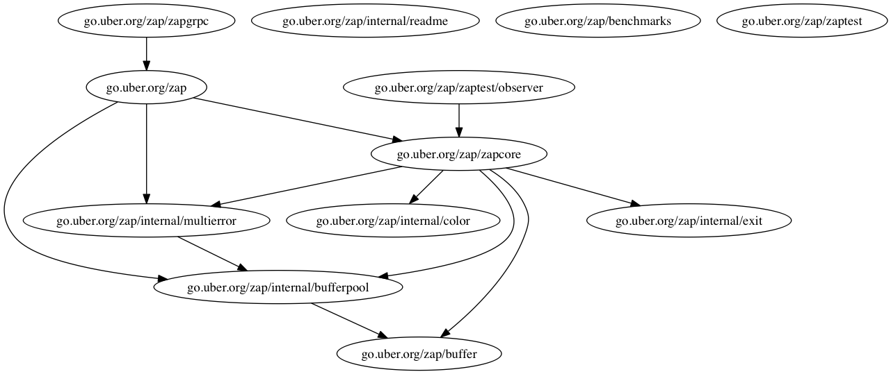
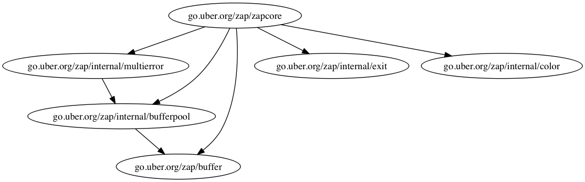

# GoImportDot

## What is GoImportDot ?

GoImportDot is a tiny tool to generate a `dot` file (used for Graphviz) of imports of golang package.It has two purpose.

* Help people quickly understand how a package organization without going into details of code.
* Help people find out whether a package is too confusing and needs to be refactored.

## Quick Start

```
go get -u yqylovy/goimportdot
goimportdot -pkg=yourpackagename > pkg.dot 
dot -Tsvg pkg.dot >pkg.svg
```

## Example

Get a graph of `go.uber.org/zap`

```
goimportdot -pkg=go.uber.org/zap > zap.dot
dot -Tpng zap.dot > zap.png
```




Only get a graph of zapcore in `go.uber.org/zap`

```
goimportdot -pkg=go.uber.org/zap -root=go.uber.org/zap/zapcore > zapcore.dot
dot -Tpng zapcore.dot > zapcore.png
```


