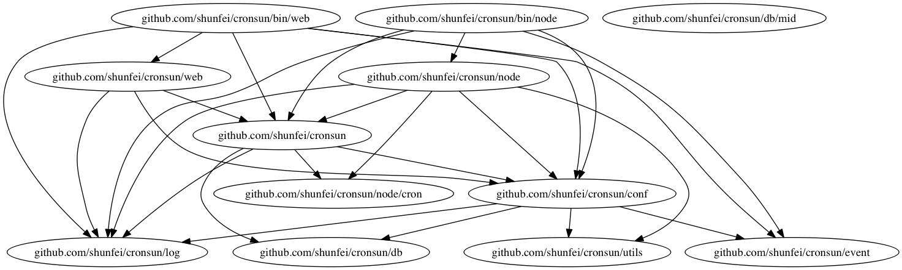
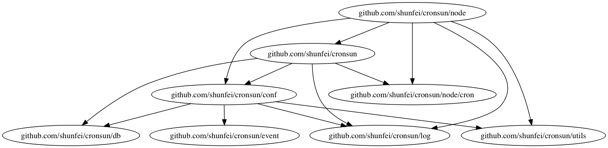
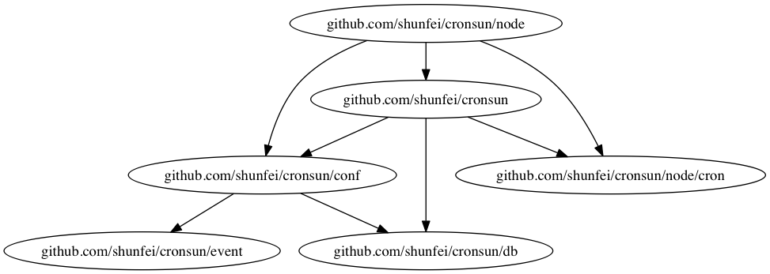

# goimportdot : 一个帮你迅速了解 golang 项目结构的工具

## 简介

很多时候，当我们想熟悉一个 `golang` 项目时，都需要能快速地对代码的整体结构有个宏观了解，初步明白项目是如何组织构成的。在有了大体的概念后，再选择适当的切入点，专注于代码的核心部分进行研究，达到熟悉项目的目的。 `goimportdot` 就是一个根据 `golang` 中 `import` 生成调用关系，再配合 `Graphviz` 生成调用图的工具。


## 安装 

```
go get -u github.com/yqylovy/goimportdot
```

在安装后会在 `$GOPATH/bin` 路径中生成 `goimportdot` 文件。

---

## 使用示例

以 `github.com/shunfei/cronsun` 作为示例，这是一个分布式任务系统，类似于 `crontab`。首先我们把代码下载下来。

```
go get github.com/shunfei/cronsun
```

使用 `goimportdot` 对项目结构进行解析。再通过 dot 把 解析结构转化为 `png` 图片。

```
goimportdot -pkg=github.com/shunfei/cronsun > cronsun.dot
dot -Tpng cronsun.dot > cronsun.png
```

打开 `cronsun.png`,图片如下：



可以看到现在项目整体结构一目了然，存在两个入口 `github.com/shunfei/cronsun/bin/node` 和 `github.com/shunfei/cronsun/bin/web`。

`cronsun` 还是个轻量级、整洁的项目，可以一目了然。作者在分析更复杂的项目的时候，发现生成的调用图非常复杂，看上去像一团乱麻，难以入手。这时候需要减少信息量，逐步分析。依旧以 `cronsun` 为例。如果我们只想分析 `cronsun` 的 `node` 部分：

```
goimportdot -pkg=github.com/shunfei/cronsun -root=github.com/shunfei/cronsun/node > cronsun.node.dot
dot -Tpng cronsun.node.dot > cronsun.node.png
```

图片结果：



项目中通常会存在一些辅助工具，如 `log` 包，被大量地引用，在分析时可以通过指定黑名单来达到忽略某些包的目的:

```
# 忽略其中的 log、utils
goimportdot -pkg=github.com/shunfei/cronsun -root=github.com/shunfei/cronsun/node -filter=b:*utils,*log > cronsun.node.core.dot
dot -Tpng cronsun.node.core.dot > cronsun.node.core.png
```

图片结果：




通过指定 `root` 和 `filter`,可以有效地减少输出，快速地把握核心。

## 结语

`goimportdot`是个刚推出的小工具，还有很多不成熟的地方，欢迎提出建议。
项目地址： [https://github.com/yqylovy/goimportdot](https://github.com/yqylovy/goimportdot) 


